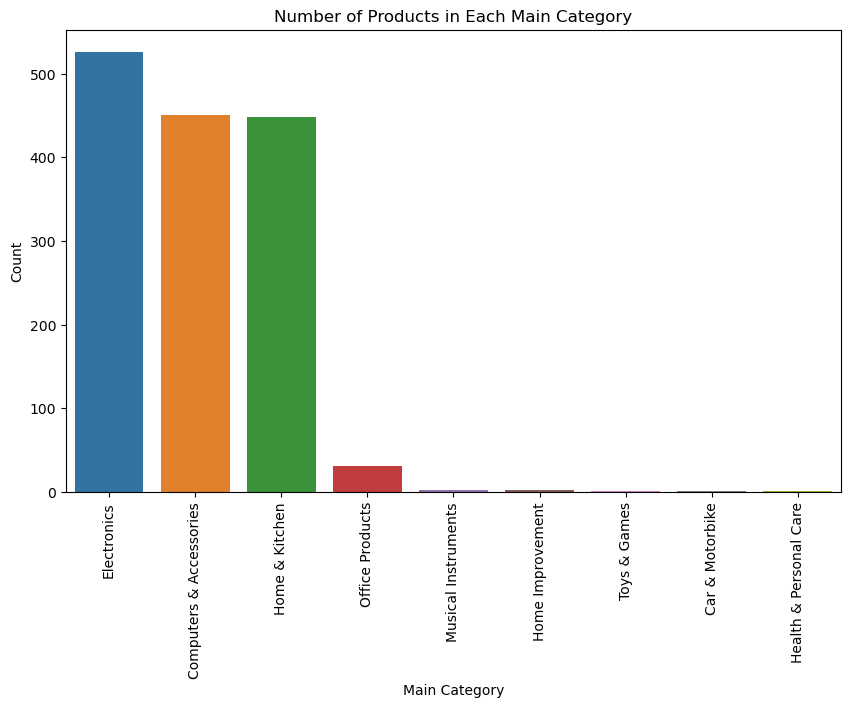
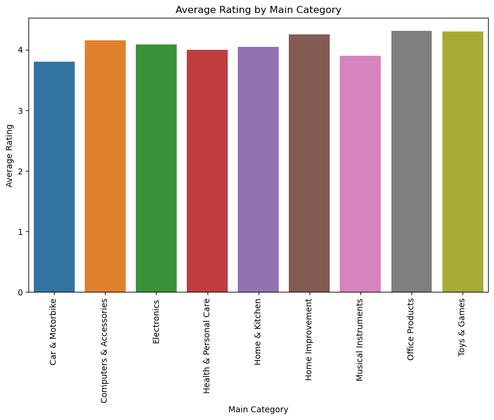
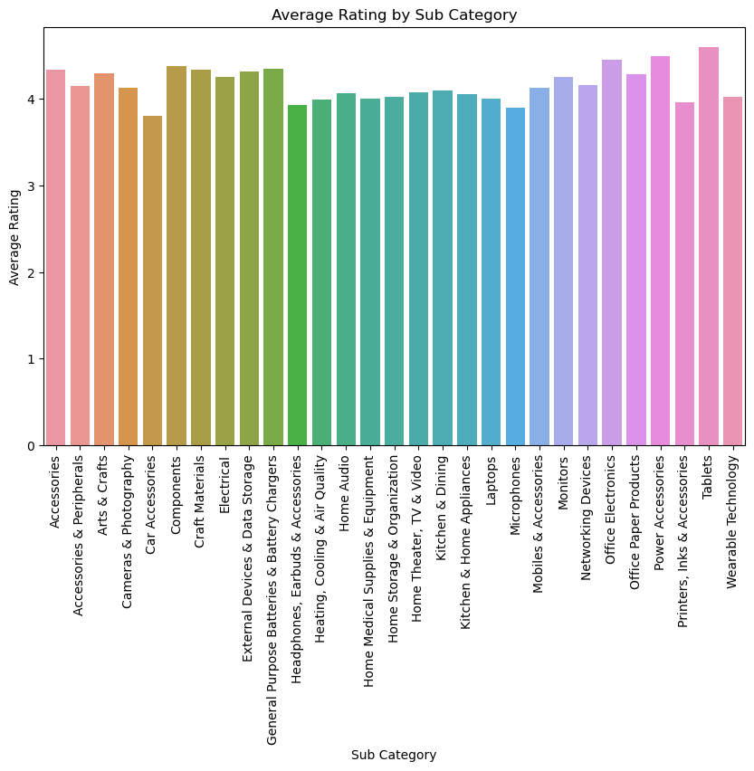
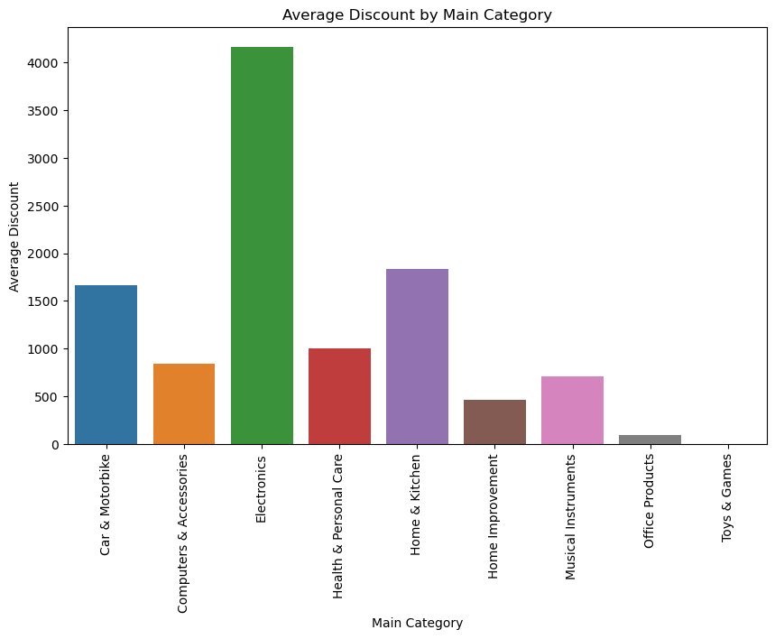
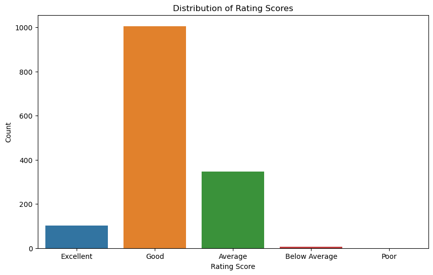
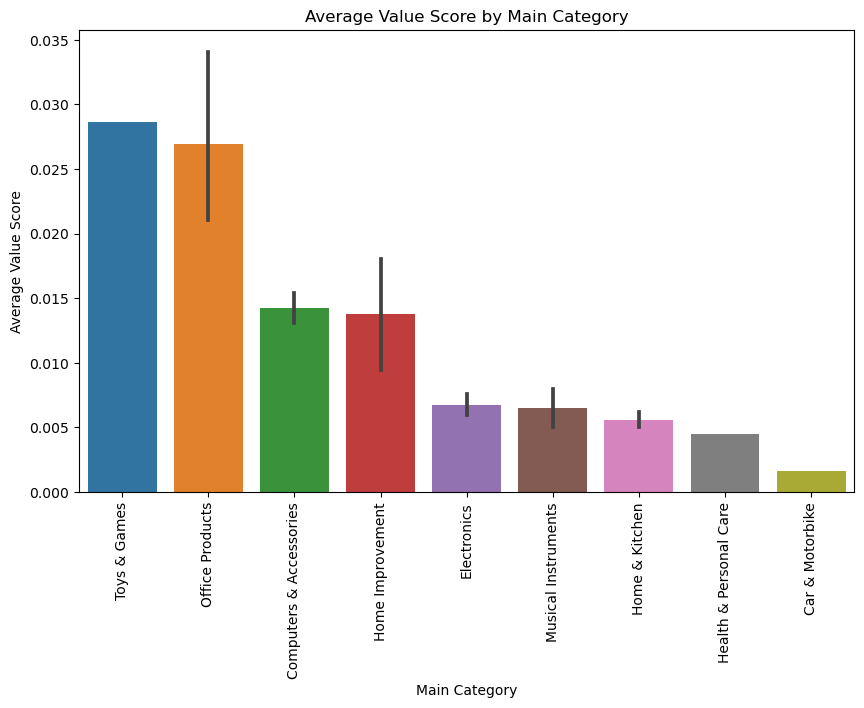

# Amazon Sales EDA

## Project Description
Amazon is an American Tech Multi-National Company whose business interests include E-commerce, where they buy and store the inventory, and take care of everything from shipping and pricing to customer service and returns.

This project analyzes Amazon product data, focusing on the pricing, discounts, and customer ratings listed on the official Amazon website.

## Objectives
- Clean and prepare data for proper analysis
- Analyze product categories and sub-categories
- Identify top-rated and best-value products
- Examine the relationship between price, discounts, and ratings
- Provide actional business recommendations

## Dataset Description
In the dataset, there are over 1k of Amazon product’s ratings and reviews in the csv file with the following features:
    - product_id - product identifier
    - product_name - name of the product
    - category - category of the product
    - discounted_price - discount price of the product
    - actual_price - the price before the discount
    - discount_percentage - calculated percentage of the discount applied to the product
    - rating - the rating of the product
    - rating_count - the number of people who rate the product
    - about_product - the description of the product
    - user_id - the ID of the user who reviewed the product
    - user_name - the name of the user who reviewed the product
    - review_id - the ID of the user review
    - review_title - the short review of the user
    - review_content - the long review of the user
    - img_link - the image link to the product
    - product_link - the link to the product on the official website

## Data Cleaning
The following steps were performed to prepare the dataset:
- Removed missing and duplicate values
- Converted price columns to numeric format
- Cleaned invalid rating values
- Split category column into main_category and sub_category

## Exploratory Data Analysis (EDA)
In this project, the key analyses performed includes:
- Product distribution across categories
- Average rating by category and sub-category
- Discount analysis across products
- Relationship between price and discount
- Relationship between price and rating
- Value score calculation and interpretation

## Key Visualization
### Category Distribution

### Average Rating by Category and Sub-Category

### Average Discount by Category

### Rating Distribution

### Average Value Score by Category

## Key Insights
- The Computers & Accessories category demonstrates the highest value score, indicating that customers receive strong quality relative to price.
- The Electronics category offers the largest discounts, particularly for high-priced items.
- The analysis shows a weak relationship between discounts and ratings, suggesting that discounts do not significantly influence customer satisfaction.
- Categories with a large number of products tend to have slightly lower average ratings, indicating potential inconsistencies in quality.
- Some categories have very few products, which may indicate limited offerings or low demand.
- The value score effectively identifies products that offer high customer satisfaction at lower costs.

## Business Recommendations
Based on the key insights and findings, Amazon should:
- Prioritize promoting products "Computers & Accessories" category as “best value for money” to attract price-sensitive customers and increase conversion rates.
- Emphasize "Electronics" for major promotional campaigns to attract customers due to high discount prices.
- Focus on improving product quality and customer experience rather than relying heavily on discount strategies.
- Regularly monitor products in high-volume categories, removing or improving low-performing items to maintain overall customer satisfaction.
- Incorporate the value score metric into recommendation systems to highlight “best value” products to customers.

## Tools & Technologies
- Python (Pandas, Numpy, Matplotlib, Seaborn)
- Jupyter Notebook

## Conclusion
Overall, the analysis of Amazon product ratings, reviews, and pricing shows clear differences across categories in both catalog size and discount behavior. Moreover, key results indicate that customer satisfaction in this dataset is driven more by product performance/quality than by promotional depth. Therefore, Amazon should focus on balancing pricing strategies with product quality to maximize their performance.

## Limitations and Future Improvements
Limitations to keep in mind
- The dataset is relatively small (≈1.4k rows) and appears to cover specific categories more heavily than others.
- Ratings are also bounded and may be influenced by review volume and selection bias. 

Future work could strengthen the study by 
- Build a product recommendation system
- Perform sentiment analysis on customer reviews
- Develop an interactive dashboard